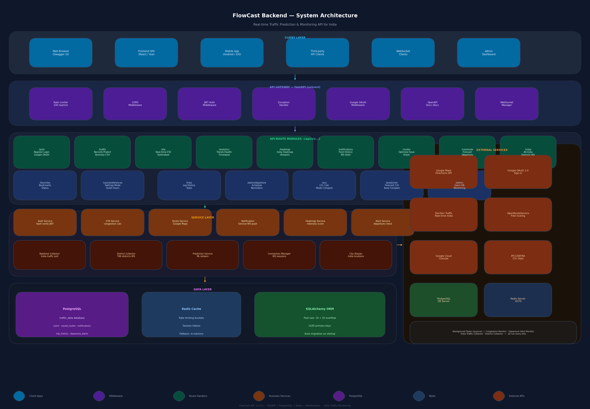

# FlowCast Backend

Real-time traffic prediction and monitoring API for India — built with FastAPI, PostgreSQL, Redis, and WebSockets.



---

## Table of Contents

- [Overview](#overview)
- [Tech Stack](#tech-stack)
- [Architecture](#architecture)
- [Quick Start](#quick-start)
- [Environment Variables](#environment-variables)
- [API Reference](#api-reference)
  - [Health](#health)
  - [Authentication](#authentication)
  - [Traffic Data](#traffic-data)
  - [ETA Calculation](#eta-calculation)
  - [Analytics](#analytics)
  - [Heatmap](#heatmap)
  - [Notifications](#notifications)
  - [Route Optimization](#route-optimization)
  - [Multi-Modal Journey Planner](#multi-modal-journey-planner)
  - [Commute Planner](#commute-planner)
  - [Favorite Locations](#favorite-locations)
  - [User Preferences](#user-preferences)
  - [Trip History](#trip-history)
  - [Departure Alerts](#departure-alerts)
  - [Carbon Footprint](#carbon-footprint)
  - [Weather Impact](#weather-impact)
  - [India Traffic](#india-traffic)
  - [India Districts (WebSocket)](#india-districts-websocket)
  - [Area Prediction](#area-prediction)
  - [AI Traffic Copilot](#ai-traffic-copilot)
  - [Organization Management](#organization-management)
  - [Fleet Management](#fleet-management)
  - [Geofence Zones](#geofence-zones)
  - [Webhook Integrations](#webhook-integrations)
  - [Alert Rules Engine](#alert-rules-engine)
  - [Traffic Reports](#traffic-reports)
  - [Admin](#admin)
- [WebSocket Endpoints](#websocket-endpoints)
- [Background Services](#background-services)
- [Database Schema](#database-schema)
- [Rate Limiting](#rate-limiting)
- [Google OAuth Setup](#google-oauth-setup)
- [Running Tests](#running-tests)
- [Project Structure](#project-structure)

---

## Overview

FlowCast is a production-grade backend API that provides:

- **Real-time traffic monitoring** across India (766 districts, major cities)
- **ML-powered congestion prediction** using scikit-learn
- **Live ETA calculation** with congestion-aware speed adjustment
- **Route optimization** via Google Maps Directions API + multi-modal journey planning
- **Departure alert system** with WebSocket push notifications
- **Carbon footprint calculator** for mode comparison
- **Weather-traffic correlation** with congestion impact modifiers
- **Organization management** with multi-user workspaces (Owner / Admin / Member roles)
- **Fleet management** with vehicle tracking and driver behavior scoring
- **Smart geofence zones** with configurable congestion threshold alerts
- **Webhook integrations** for real-time event delivery to external systems
- **Custom alert rules engine** with condition-based triggers
- **AI Traffic Copilot** — natural language traffic intelligence powered by Claude
- **On-demand and scheduled traffic reports**
- **Admin dashboard** with system health monitoring

---

## Tech Stack

| Layer | Technology |
|---|---|
| API Framework | FastAPI 0.110+ with uvicorn |
| Database | PostgreSQL 14+ via SQLAlchemy ORM |
| Cache / Rate Limiting | Redis (fallback: in-memory) |
| Auth | JWT (HS256) + Google OAuth 2.0 |
| ML / Prediction | scikit-learn (RandomForest / LinearRegression) |
| Real-time | WebSockets (FastAPI native) |
| External APIs | Google Maps Directions, TomTom Traffic, OpenRouteService, OpenWeatherMap |
| AI | Claude (Anthropic) — AI Copilot chat |
| Python | 3.12 |

---

## Architecture

```
CLIENT LAYER
  Web Browser · React SPA · Mobile App · WebSocket Clients · Admin Dashboard
        │
        ▼
API GATEWAY (FastAPI / uvicorn)
  Rate Limiter · CORS · JWT Auth · Google OAuth · WebSocket Manager
        │
        ▼
ROUTE MODULES  /api/v1/...
  /auth  /traffic  /eta  /analytics  /heatmap  /notifications
  /routes  /commute  /favorites  /preferences  /trips  /alerts
  /eco  /india  /prediction  /weather  /ai  /org  /fleet
  /zones  /webhooks  /rules  /reports  /admin
        │
        ▼
SERVICE LAYER
  AuthService · ETAService · RouteService · NotificationService
  HeatmapService · AlertService · PredictionService · RealtimeCollector
  DistrictCollector · ConnectionManager · CityAliases · WeatherService
  BehaviorService · WebhookService
        │
        ▼
DATA LAYER
  PostgreSQL (traffic_data DB)  ·  Redis Cache  ·  SQLAlchemy ORM
        │
        ▼
EXTERNAL SERVICES
  Google Maps API · Google OAuth 2.0 · TomTom Traffic · OpenRouteService
  OpenWeatherMap · Anthropic Claude API
```

The architecture diagram (`flowcast_architecture.png`) provides a full visual breakdown of all layers and components.

---

## Quick Start

### Prerequisites

- Python 3.12+
- PostgreSQL 14+ running locally
- Redis (optional — falls back to in-memory rate limiting)
- Google Maps API key (for route optimization)

### 1. Clone and install

```bash
git clone https://github.com/your-org/flowcast-backend.git
cd flowcast-backend
python -m venv venv
venv\Scripts\activate        # Windows
# source venv/bin/activate   # macOS / Linux
pip install -r requirements.txt
```

### 2. Configure environment

Copy and edit the environment file:

```bash
cp .env.example .env
# Edit .env with your database credentials and API keys
```

### 3. Create the database

```sql
-- In psql:
CREATE DATABASE "traffic-data";
```

### 4. Run the server

```bash
uvicorn app.main:app --reload --host 0.0.0.0 --port 8000
```

On first startup FlowCast will:
- Run schema migrations (UUID column upgrades)
- Create all tables via `create_all()`
- Seed the default admin account (`admin@flowcast.in` / `Admin@1234`)
- Start background monitors (congestion, departure alerts, India traffic, district collector, zone alert monitor)

### 5. Open the docs

- Swagger UI: [http://localhost:8000/docs](http://localhost:8000/docs)
- ReDoc: [http://localhost:8000/redoc](http://localhost:8000/redoc)

**Quick auth flow in Swagger:**
1. `POST /api/v1/auth/register` — create an account
2. `POST /api/v1/auth/login` — copy `access_token`
3. Click **Authorize** (lock icon, top-right) → paste token → **Authorize**
4. All protected endpoints are now unlocked

---

## Environment Variables

| Variable | Required | Description |
|---|---|---|
| `DATABASE_URL` | Yes | PostgreSQL connection string |
| `SECRET_KEY` | Yes | JWT signing key (32+ random bytes) |
| `GOOGLE_MAPS_DIRECTIONS_API_KEY` | Yes | Google Maps Directions API key |
| `GOOGLE_CLIENT_ID` | No | Google OAuth 2.0 Client ID |
| `GOOGLE_CLIENT_SECRET` | No | Google OAuth 2.0 Client Secret |
| `GOOGLE_REDIRECT_URI` | No | OAuth callback URL (must match Google Console) |
| `TOMTOM_API_KEY` | No | TomTom Traffic API key (2500 req/day free) |
| `ORS_API_KEY` | No | OpenRouteService API key (free) |
| `OPENWEATHERMAP_API_KEY` | No | OpenWeatherMap API key (weather-traffic correlation) |
| `ANTHROPIC_API_KEY` | No | Anthropic API key (AI Traffic Copilot) |
| `REDIS_URL` | No | Redis connection string (default: `redis://localhost:6379`) |
| `ADMIN_EMAIL` | No | Admin account email (default: `admin@flowcast.in`) |
| `ADMIN_PASSWORD` | No | Admin account password (default: `Admin@1234`) |
| `APP_ENV` | No | `development` or `production` |
| `DEBUG` | No | `True` / `False` |

---

## API Reference

All endpoints are prefixed with `/api/v1`. All timestamps are returned in **IST (Asia/Kolkata, UTC+5:30)**.

### Health

| Method | Path | Auth | Description |
|---|---|---|---|
| GET | `/` | No | Liveness check |
| GET | `/health` | No | Health status |

---

### Authentication

Base path: `/api/v1/auth`

| Method | Path | Auth | Description |
|---|---|---|---|
| POST | `/auth/register` | No | Register a new account |
| POST | `/auth/login` | No | Email/password login — returns JWT |
| GET | `/auth/me` | JWT | Get current user profile |
| PUT | `/auth/me` | JWT | Update full name |
| POST | `/auth/change-password` | JWT | Change password |
| DELETE | `/auth/me` | JWT | Delete account |
| GET | `/auth/google/login` | No | Google OAuth sign-in page |
| GET | `/auth/google/callback` | No | OAuth callback — displays token |
| POST | `/auth/google/token` | No | Verify Google ID token from frontend |

**Register request:**
```json
{
  "email": "user@example.com",
  "full_name": "Ravi Kumar",
  "password": "SecurePass1"
}
```

**Login response:**
```json
{
  "access_token": "<jwt>",
  "token_type": "bearer",
  "expires_in": 1800,
  "user": {
    "id": "<uuid>",
    "email": "user@example.com",
    "full_name": "Ravi Kumar",
    "is_admin": false,
    "auth_provider": "local"
  }
}
```

Password rules: minimum 8 characters, at least 1 uppercase letter and 1 digit.

---

### Traffic Data

Base path: `/api/v1/traffic`

| Method | Path | Auth | Description |
|---|---|---|---|
| GET | `/traffic/records` | JWT | List traffic records (paginated, filterable) |
| POST | `/traffic/records` | JWT | Submit a single traffic record |
| POST | `/traffic/records/bulk` | JWT | Bulk insert up to 50 records |
| GET | `/traffic/records/{id}` | JWT | Get a specific record |
| DELETE | `/traffic/records/{id}` | JWT | Delete a record |
| POST | `/traffic/predict` | JWT | Predict congestion for a location |
| GET | `/traffic/anomalies` | JWT | Detect anomalous traffic patterns |
| GET | `/traffic/export/csv` | JWT | Export records as CSV |
| GET | `/traffic/incidents` | No | Active traffic incidents |
| POST | `/traffic/incidents` | JWT | Report a new incident |

**Submit record request:**
```json
{
  "location": "Hitech City",
  "latitude": 17.4486,
  "longitude": 78.3908,
  "vehicle_count": 245,
  "average_speed": 32.5,
  "congestion_level": "medium",
  "road_type": "arterial"
}
```

**Query parameters for `/traffic/records`:**
- `location` — filter by location name (partial match)
- `congestion_level` — `low`, `medium`, or `high`
- `skip`, `limit` — pagination

---

### ETA Calculation

| Method | Path | Auth | Description |
|---|---|---|---|
| GET | `/traffic/eta` | No | Single-location real-time ETA |
| POST | `/traffic/eta/batch` | No | Batch ETA for multiple locations |
| GET | `/traffic/eta/locations` | No | List all monitored Hyderabad locations |

**Query parameters for single ETA:**
- `location` — Hyderabad area name (e.g. `Hitech City`, `Banjara Hills`)
- `distance_km` — trip distance in km (max 500)
- `mode` — `driving` (default), `walking`, `transit`

**ETA response:**
```json
{
  "location": "Hitech City",
  "distance_km": 10,
  "mode": "driving",
  "congestion_level": "medium",
  "average_speed_kmh": 28.4,
  "eta_minutes": 21,
  "eta_range": { "min": 19, "max": 24 },
  "confidence": "high",
  "last_updated": "2026-05-27T14:32:10+05:30"
}
```

---

### Analytics

Base path: `/api/v1/analytics`

| Method | Path | Auth | Description |
|---|---|---|---|
| GET | `/analytics/trends` | JWT | Congestion trend data (24 h or custom range) |
| GET | `/analytics/snapshot` | JWT | Current network-wide traffic snapshot |
| GET | `/analytics/city-health` | JWT | City health score (0–100) |
| GET | `/analytics/timelapse` | JWT | Hourly heatmap frames for animation |

**`/analytics/trends` query parameters:**
- `location` — area name (optional)
- `hours` — look-back window (default: 24)

**`/analytics/city-health` response:**
```json
{
  "city": "Hyderabad",
  "health_score": 72,
  "congestion_index": 0.28,
  "avg_speed_kmh": 34.5,
  "incident_count": 3,
  "trend": "improving"
}
```

---

### Heatmap

| Method | Path | Auth | Description |
|---|---|---|---|
| GET | `/heatmap` | JWT | Coordinate-level congestion intensity grid |

Returns coordinate points with `lat`, `lng`, and `intensity` (0.0–1.0) — suitable for overlaying on Leaflet, Google Maps, or Mapbox.

---

### Notifications

Base path: `/api/v1/notifications`

| Method | Path | Auth | Description |
|---|---|---|---|
| GET | `/notifications` | JWT | List notifications (paginated, auto-seeded on first visit) |
| GET | `/notifications/stats` | JWT | Notification statistics |
| PUT | `/notifications/read-all` | JWT | Mark all notifications as read |
| PUT | `/notifications/{id}/read` | JWT | Mark one notification as read |
| DELETE | `/notifications/{id}` | JWT | Delete a notification |
| WS | `/notifications/ws/{user_id}` | No | Real-time notification push stream |

On first visit, FlowCast auto-seeds 8 realistic notifications (congestion alerts, zone alerts, departure reminders, weather warnings) with location context extracted from notification titles.

**`GET /notifications` query parameters:**
- `skip`, `limit` — pagination (default: 0 / 50)
- `unread_only` — `true` to filter unread

**Notification object:**
```json
{
  "id": "<uuid>",
  "type": "congestion_alert",
  "title": "Critical Congestion — Silk Board Junction",
  "message": "Vehicle count up 60% in the last 15 minutes.",
  "severity": "critical",
  "location": "Silk Board Junction",
  "is_read": false,
  "created_at": "2026-06-14T08:22:10+05:30"
}
```

**Stats response:**
```json
{
  "total": 12,
  "unread": 4,
  "read_count": 8,
  "unread_critical": 1,
  "severity_breakdown": { "low": 3, "medium": 7, "high": 1, "critical": 1 },
  "type_breakdown": { "congestion_alert": 5, "system": 7 }
}
```

---

### Route Optimization

Base path: `/api/v1/routes`

| Method | Path | Auth | Description |
|---|---|---|---|
| POST | `/routes/optimize` | JWT | Optimize a route via Google Maps + live traffic |
| GET | `/routes/saved` | JWT | List saved routes |
| POST | `/routes/saved` | JWT | Save a route |
| DELETE | `/routes/saved/{id}` | JWT | Delete a saved route |
| POST | `/routes/saved/{id}/share` | JWT | Generate a shareable link |
| GET | `/routes/share/{token}` | No | View a shared route |

Coordinates must be within India: **lat 6.0–37.5, lng 68.0–97.5**.

**Optimize request (coordinates or location names):**
```json
{
  "origin": "Miyapur",
  "destination": "Hitech City",
  "mode": "driving",
  "alternatives": true
}
```

You may also pass coordinate objects: `{ "lat": 17.4486, "lng": 78.3908 }`.

---

### Multi-Modal Journey Planner

Base path: `/api/v1/routes`

| Method | Path | Auth | Description |
|---|---|---|---|
| GET | `/routes/multimodal` | JWT | Compare all transport modes for a journey |

Returns a side-by-side comparison of driving, motorcycle, bus, metro, cycling, and walking — each with ETA, distance, CO₂ emissions, calories burned, and a recommendation score. Accepts location names or coordinates.

**Query parameters:**
- `origin` — departure location (name or `lat,lng`)
- `destination` — arrival location (name or `lat,lng`)

**Response:**
```json
{
  "origin": "Andheri East",
  "destination": "BKC",
  "recommended_mode": "metro",
  "modes": [
    {
      "mode": "metro",
      "eta_minutes": 22,
      "distance_km": 8.4,
      "co2_kg": 0.08,
      "calories": 0,
      "cost_inr": 40,
      "score": 91
    }
  ]
}
```

---

### Commute Planner

Base path: `/api/v1/commute`

| Method | Path | Auth | Description |
|---|---|---|---|
| GET | `/commute/forecast` | JWT | 24-hour rush-hour forecast for a location |
| GET | `/commute/best-departure` | JWT | Optimal departure window to avoid congestion |
| GET | `/commute/score` | JWT | Commute friendliness score (0–100) |

**`/commute/forecast` response includes `hourly` array:**
```json
{
  "location": "Gachibowli",
  "date": "2026-06-14",
  "peak_hours": ["08:00–10:00", "17:30–19:30"],
  "best_departure": "07:15",
  "hourly": [
    { "hour": "06:00", "congestion": "low", "score": 88 },
    { "hour": "08:00", "congestion": "high", "score": 32 }
  ]
}
```

---

### Favorite Locations

Base path: `/api/v1/favorites`

| Method | Path | Auth | Description |
|---|---|---|---|
| GET | `/favorites` | JWT | List bookmarked locations |
| POST | `/favorites` | JWT | Add a favorite location |
| DELETE | `/favorites/{id}` | JWT | Remove a favorite |
| GET | `/favorites/{id}/status` | JWT | Live traffic status for a favorite |

---

### User Preferences

Base path: `/api/v1/user/preferences`

| Method | Path | Auth | Description |
|---|---|---|---|
| GET | `/user/preferences` | JWT | Get current preferences |
| PUT | `/user/preferences` | JWT | Update preferences |

**Preferences schema:**
```json
{
  "notifications_enabled": true,
  "preferred_mode": "driving",
  "quiet_hours_start": "22:00",
  "quiet_hours_end": "07:00",
  "congestion_threshold": "high",
  "language": "en"
}
```

---

### Trip History

Base path: `/api/v1/trips`

| Method | Path | Auth | Description |
|---|---|---|---|
| POST | `/trips` | JWT | Log a completed trip |
| GET | `/trips` | JWT | List trip history (paginated) |
| GET | `/trips/stats` | JWT | Personal commute statistics |
| DELETE | `/trips/{id}` | JWT | Delete a trip record |

**Log trip request:**
```json
{
  "origin": "Hitech City",
  "destination": "Banjara Hills",
  "distance_km": 12.5,
  "duration_minutes": 28,
  "mode": "driving",
  "congestion_level": "medium",
  "notes": "Usual morning route"
}
```

**Stats response includes:**
- Total trips, total distance, average duration
- Trips in the last 7 and 30 days
- ETA accuracy stats
- Distance breakdown (min, max, average)
- Most-used travel mode
- First and last trip timestamps

**Pagination fields:**
```json
{
  "trips": [...],
  "total": 45,
  "returned": 10,
  "has_more": true
}
```

---

### Departure Alerts

Base path: `/api/v1/alerts`

| Method | Path | Auth | Description |
|---|---|---|---|
| GET | `/alerts/departure` | JWT | List all departure alerts |
| POST | `/alerts/departure` | JWT | Create a departure alert |
| PUT | `/alerts/departure/{id}/toggle` | JWT | Enable / disable an alert |
| DELETE | `/alerts/departure/{id}` | JWT | Delete an alert |

When an alert fires, a **WebSocket push** is sent to all connected sessions for that user.

**Create alert request:**
```json
{
  "route_name": "Home to Office",
  "origin": "Miyapur",
  "destination": "Hitech City",
  "departure_time": "08:30",
  "advance_notice_minutes": 15,
  "days_of_week": ["monday", "tuesday", "wednesday", "thursday", "friday"]
}
```

`days_of_week` accepts full day names (e.g. `"monday"`) or short forms (`"mon"`). Duplicate alerts (same user + route name + departure time) are rejected with `409 Conflict`.

---

### Carbon Footprint

Base path: `/api/v1/eco`

| Method | Path | Auth | Description |
|---|---|---|---|
| GET | `/eco/footprint` | JWT | CO₂ footprint for a specific trip |
| GET | `/eco/compare` | JWT | Side-by-side mode comparison |
| GET | `/eco/tips` | JWT | Personalised eco tips |

**Footprint response:**
```json
{
  "distance_km": 15,
  "mode": "car",
  "co2_emissions": "2.55 kg",
  "trees_to_offset": 0.14,
  "equivalent_km_of_flying": 10.2,
  "tip": "Switching to public transit saves 2.3 kg CO₂ on this route."
}
```

**Mode comparison** covers: Car, Motorcycle, Bus, Metro, Cycling, Walking — each with:
- CO₂ emissions (shown in grams or kg)
- Calories burned
- Savings vs. driving (absolute and percentage)
- Trees required to offset annually

---

### Weather Impact

Base path: `/api/v1/weather`

| Method | Path | Auth | Description |
|---|---|---|---|
| GET | `/weather/cities` | No | Live weather snapshot for all 20 monitored cities |
| GET | `/weather/city-ids` | No | Directory of stable `city_id` → city name mappings |
| GET | `/weather/city/{city_id}` | No | Weather + congestion impact for one city (by UUID) |
| GET | `/weather/impact` | No | Weather impact for any traffic location string |
| GET | `/weather/status` | No | Cache freshness and OWM configuration status |

**`/weather/cities` response:**
```json
{
  "total": 20,
  "severe_impact": 0,
  "moderate_impact": 2,
  "light_impact": 5,
  "clear_cities": 13,
  "network_alert": "minor",
  "cities": [
    {
      "city": "Mumbai",
      "city_id": "<uuid>",
      "temp_c": 31.2,
      "temp": 31.2,
      "condition": "Heavy Rain",
      "wind_kmh": 42.0,
      "wind": 42.0,
      "visibility_km": 3.1,
      "visibility": 3.1,
      "congestion_modifier": "moderate",
      "congestionModifier": 0.3,
      "alert_level": "caution"
    }
  ]
}
```

`city_id` values are stable UUID5 hashes of the city name — safe to store in the frontend. Pass any traffic location string to `/weather/impact` to get the nearest city's congestion modifier.

**Congestion modifier levels:**
| Modifier | Float | Meaning |
|---|---|---|
| `none` | 0.0 | Normal driving conditions |
| `light` | 0.1 | Minor slowdowns possible |
| `moderate` | 0.3 | 20–40% longer travel times |
| `severe` | 0.5 | Major delays — consider postponing |

Data source: OpenWeatherMap (if `OPENWEATHERMAP_API_KEY` is set) or simulated data. Cache refreshed every 30 minutes.

---

### India Traffic

Base path: `/api/v1/india`

| Method | Path | Auth | Description |
|---|---|---|---|
| GET | `/india/overview` | No | National traffic summary |
| GET | `/india/cities` | No | Traffic status for all major cities |
| GET | `/india/cities/{city}` | No | Single city traffic detail |
| GET | `/india/heatmap` | No | State-level congestion heatmap data |
| GET | `/india/hotspots` | No | Top congestion hotspots nationwide |
| GET | `/india/health` | No | City health scores ranked |

Covers 50+ cities across all Indian states. Data is refreshed every 60 seconds via TomTom Traffic API.

---

### India Districts (WebSocket)

| Method | Path | Auth | Description |
|---|---|---|---|
| GET | `/india/districts` | No | All 766 districts (REST snapshot) |
| GET | `/india/districts/{district}` | No | Single district traffic data |
| WS | `/india/ws/districts` | No | Live district updates via WebSocket |

**WebSocket connection:**
```javascript
const ws = new WebSocket("ws://localhost:8000/api/v1/india/ws/districts");
ws.onmessage = (event) => {
  const data = JSON.parse(event.data);
  // data: { districts: [...], timestamp: "2026-06-14T14:32:10+05:30" }
};
```

District data is broadcast every 60 seconds with live congestion scores for all 766 Indian districts.

---

### Area Prediction

Base path: `/api/v1/prediction`

| Method | Path | Auth | Description |
|---|---|---|---|
| GET | `/prediction/forecast` | JWT | 12-hour congestion forecast for an area |
| GET | `/prediction/hourly-pattern` | JWT | Historical hourly traffic pattern |
| GET | `/prediction/compare` | JWT | Side-by-side multi-area comparison |

The prediction service uses a scikit-learn model trained on historical traffic records. Features include: hour of day, vehicle count, road type, and day of week.

---

### AI Traffic Copilot

Base path: `/api/v1/ai`

| Method | Path | Auth | Description |
|---|---|---|---|
| POST | `/ai/chat` | JWT | Ask any traffic question in natural language |
| GET | `/ai/departure` | JWT | AI-recommended departure time for a journey |
| GET | `/ai/model-info` | JWT | ML model metadata and performance stats |
| GET | `/ai/forecast` | JWT | AI-enhanced congestion forecast |

Powered by Claude (Anthropic) with live FlowCast traffic data injected as context.

**Chat request:**
```json
{
  "message": "Should I leave for the airport now or wait 30 minutes?",
  "location": "Powai",
  "destination": "Mumbai Airport"
}
```

**`/ai/departure` query parameters:**
- `origin` — departure location
- `destination` — arrival location
- `target_arrival` — desired arrival time (e.g. `"09:00"`)
- `distance_km` — optional; auto-calculated from location names if omitted

**`/ai/forecast` response includes:**
- `hourly` — list of hourly congestion predictions
- `confidence` — model confidence score
- `weather_adjusted` — whether weather modifier was applied
- `recommendations` — natural language tips

---

### Organization Management

Base path: `/api/v1/org`

| Method | Path | Auth | Description |
|---|---|---|---|
| GET | `/org` | JWT | Get your primary organization |
| GET | `/org/members` | JWT | List all members of your organization |
| POST | `/org/invite` | JWT | Invite a user by email |
| PUT | `/org/members/{user_id}` | JWT | Change a member's role |
| DELETE | `/org/members/{user_id}` | JWT | Remove a member |

On first call, FlowCast auto-creates a personal workspace (`"{Name}'s Workspace"`) if the user has no organization.

**`GET /org` response:**
```json
{
  "id": "<uuid>",
  "name": "Ravi's Workspace",
  "plan": "enterprise",
  "my_role": "owner",
  "your_role": "owner"
}
```

**`GET /org/members` response:**
```json
{
  "members": [
    {
      "id": "<uuid>",
      "user_id": "<uuid>",
      "full_name": "Ravi Kumar",
      "email": "ravi@example.com",
      "role": "owner",
      "joined_at": "2026-06-14T10:00:00+05:30",
      "is_active": true
    }
  ],
  "total": 1
}
```

**Invite request:**
```json
{ "email": "teammate@example.com", "role": "member" }
```

**Role change request:**
```json
{ "role": "admin" }
```

Roles (ascending): `member` → `admin` → `owner`. Only owners can change roles or remove members.

---

### Fleet Management

Base path: `/api/v1/fleet`

| Method | Path | Auth | Description |
|---|---|---|---|
| GET | `/fleet/vehicles` | JWT | List vehicles in your organization |
| POST | `/fleet/vehicles` | JWT | Register a new vehicle |
| GET | `/fleet/vehicles/{id}` | JWT | Get vehicle detail + current ETA |
| PUT | `/fleet/vehicles/{id}` | JWT | Update vehicle info |
| DELETE | `/fleet/vehicles/{id}` | JWT | Remove a vehicle |
| GET | `/fleet/assignments` | JWT | List driver-vehicle assignments |
| POST | `/fleet/assignments` | JWT | Assign a driver to a vehicle |
| DELETE | `/fleet/assignments/{id}` | JWT | Remove an assignment |
| GET | `/fleet/behavior/{vehicle_id}` | JWT | Driver behavior logs for a vehicle |
| GET | `/fleet/scores` | JWT | Daily driver behavior scores |
| GET | `/fleet/summary` | JWT | Fleet-wide overview |

**Register vehicle request:**
```json
{
  "org_id": "<uuid>",
  "registration": "MH02AB1234",
  "make": "Tata",
  "model": "Nexon",
  "vehicle_type": "car",
  "current_location": "Andheri East"
}
```

Driver behavior scoring tracks: harsh braking, rapid acceleration, speeding events, and smooth-driving streaks — aggregated into a daily score (0–100).

---

### Geofence Zones

Base path: `/api/v1/zones`

| Method | Path | Auth | Description |
|---|---|---|---|
| GET | `/zones` | JWT | List geofence zones (auto-seeds 5 demo zones) |
| POST | `/zones` | JWT | Create a new zone |
| GET | `/zones/{id}` | JWT | Get zone detail + current congestion health |
| PUT | `/zones/{id}` | JWT | Update zone config |
| DELETE | `/zones/{id}` | JWT | Delete a zone |
| GET | `/zones/{id}/alerts` | JWT | Alert history for a zone |
| GET | `/zones/summary` | JWT | All-zones congestion overview |

**Zone types:** `rectangle` (lat/lng bounding box) or `circle` (center + radius).

**Create zone request:**
```json
{
  "name": "Silk Board Corridor",
  "city": "Bangalore",
  "zone_type": "circle",
  "center_lat": 12.9176,
  "center_lng": 77.6229,
  "radius_km": 2.5,
  "congestion_threshold": "high"
}
```

When a zone's average congestion reaches its threshold, a `ZoneAlert` is recorded and a push notification is sent. A **30-minute DB-backed cooldown** prevents duplicate alerts from firing on server restarts.

---

### Webhook Integrations

Base path: `/api/v1/webhooks`

| Method | Path | Auth | Description |
|---|---|---|---|
| GET | `/webhooks` | JWT | List your registered webhooks |
| POST | `/webhooks` | JWT | Register a new webhook endpoint |
| GET | `/webhooks/{id}` | JWT | Get webhook detail + delivery stats |
| PUT | `/webhooks/{id}` | JWT | Update webhook config |
| DELETE | `/webhooks/{id}` | JWT | Delete a webhook |
| GET | `/webhooks/{id}/deliveries` | JWT | Recent delivery log |
| POST | `/webhooks/{id}/test` | JWT | Send a test payload |
| GET | `/webhooks/events` | JWT | List all supported event types |

**Register webhook request:**
```json
{
  "name": "Slack Congestion Alerts",
  "url": "https://hooks.slack.com/services/...",
  "events": ["congestion_spike", "zone_alert"],
  "secret": "optional-hmac-secret"
}
```

**Supported events:**
| Event | Trigger |
|---|---|
| `congestion_spike` | Location jumps to high congestion |
| `congestion_clearing` | Congestion drops from high |
| `zone_alert` | Geofence zone hits threshold |
| `departure_alert` | Departure reminder fires |
| `incident_new` | New road incident reported |
| `rule_triggered` | Custom alert rule condition met |
| `speed_drop` | Average speed drops >20% |
| `speed_recovery` | Average speed recovers >20% |
| `*` | Wildcard — all events |

Webhook deliveries include HMAC-SHA256 signature in `X-FlowCast-Signature` header when a secret is set.

---

### Alert Rules Engine

Base path: `/api/v1/rules`

| Method | Path | Auth | Description |
|---|---|---|---|
| GET | `/rules` | JWT | List your alert rules |
| POST | `/rules` | JWT | Create a rule |
| GET | `/rules/{id}` | JWT | Get rule detail + evaluation history |
| PUT | `/rules/{id}` | JWT | Update a rule |
| DELETE | `/rules/{id}` | JWT | Delete a rule |
| POST | `/rules/{id}/toggle` | JWT | Enable / disable a rule |
| GET | `/rules/{id}/evaluations` | JWT | Recent rule evaluation log |

**Create rule request:**
```json
{
  "name": "Silk Board High Congestion",
  "location": "Silk Board Junction",
  "condition_metric": "congestion_level",
  "condition_operator": ">=",
  "condition_value": "high",
  "duration_minutes": 5,
  "action_type": "notify",
  "cooldown_minutes": 30
}
```

**Metrics:** `congestion_level`, `average_speed`, `vehicle_count`  
**Operators:** `>=`, `<=`, `==`, `>`, `<`  
**Action types:** `notify`, `webhook`, `both`

---

### Traffic Reports

Base path: `/api/v1/reports`

| Method | Path | Auth | Description |
|---|---|---|---|
| GET | `/reports/daily-summary` | JWT | 24-hour congestion report for a location |
| GET | `/reports/weekly` | JWT | 7-day trend report |
| GET | `/reports/scheduled` | JWT | List scheduled report subscriptions |
| POST | `/reports/scheduled` | JWT | Subscribe to a recurring report |
| DELETE | `/reports/scheduled/{id}` | JWT | Cancel a scheduled report |

**`/reports/daily-summary` query parameters:**
- `location` — area name (required)

**Daily summary response includes:**
- Hourly congestion breakdown
- Peak hour identification
- Incident count
- City health score
- Average speed

---

### Admin

Base path: `/api/v1/admin` — requires `is_admin: true`

| Method | Path | Auth | Description |
|---|---|---|---|
| GET | `/admin/users` | Admin | List all users |
| GET | `/admin/users/{id}` | Admin | Get user detail |
| PUT | `/admin/users/{id}/toggle` | Admin | Activate / deactivate user |
| DELETE | `/admin/users/{id}` | Admin | Delete user account |
| GET | `/admin/stats` | Admin | System-wide statistics |
| GET | `/admin/db/health` | Admin | Database health check |
| POST | `/admin/db/vacuum` | Admin | Run VACUUM ANALYZE |
| GET | `/admin/traffic/records` | Admin | All traffic records (unfiltered) |
| DELETE | `/admin/traffic/records/{id}` | Admin | Delete any traffic record |

Default admin credentials (change immediately in production):
- Email: `admin@flowcast.in`
- Password: `Admin@1234`

---

## WebSocket Endpoints

### User notifications

```
ws://localhost:8000/api/v1/ws/{user_id}
```

Receives real-time pushes for:
- High-congestion alerts on saved routes
- Departure alert fires
- Zone threshold alerts
- System notifications

### Notification stream

```
ws://localhost:8000/api/v1/notifications/ws/{user_id}
```

Dedicated notification WebSocket — same push content, separate channel.

### India district live feed

```
ws://localhost:8000/api/v1/india/ws/districts
```

Public endpoint. Broadcasts district-level traffic data for all 766 Indian districts every 60 seconds.

---

## Background Services

Five asyncio tasks run continuously after startup:

| Service | Interval | Description |
|---|---|---|
| Congestion Monitor | 60 s | Checks all saved routes for high congestion; pushes WebSocket notifications |
| Departure Alert Monitor | 60 s | Fires scheduled departure reminders N minutes before departure time |
| India Traffic Collector | 60 s | Polls TomTom API for city-level traffic across India |
| District Collector | 60 s | Aggregates district-level data and broadcasts via WebSocket |
| Zone Alert Monitor | 60 s | Checks geofence zones against congestion thresholds; sends alerts with 30-min DB-backed cooldown |

The Zone Alert Monitor uses a DB-backed cooldown (`ZoneAlert.triggered_at`) so duplicate alerts are suppressed even after server restarts.

---

## Database Schema

### Core tables

| Table | Primary Key | Description |
|---|---|---|
| `users` | UUID | Accounts (local + Google OAuth) |
| `traffic_records` | UUID | Raw traffic observations |
| `prediction_results` | UUID | ML prediction outputs |
| `incidents` | UUID | Reported traffic incidents |
| `saved_routes` | UUID | User-saved optimized routes |
| `notifications` | UUID | User notification inbox |
| `favorite_locations` | UUID | Bookmarked places |
| `user_preferences` | UUID | Per-user settings |
| `trip_history` | UUID | Logged journeys |
| `departure_alerts` | UUID | Scheduled departure reminders |
| `route_share_tokens` | UUID | Shareable route links |

### Organization tables

| Table | Primary Key | Description |
|---|---|---|
| `organizations` | UUID | Workspaces (unique name + slug) |
| `org_memberships` | UUID | User-to-org membership with role |

### Enterprise tables

| Table | Primary Key | Description |
|---|---|---|
| `fleet_vehicles` | UUID | Registered fleet vehicles per org |
| `fleet_assignments` | UUID | Driver-to-vehicle assignments |
| `driver_behavior_logs` | UUID | Per-trip driving events |
| `driver_daily_scores` | UUID | Daily aggregated driver scores |
| `geofence_zones` | UUID | Rectangle or circle geofence definitions |
| `zone_alerts` | UUID | Zone threshold breach records |
| `webhooks` | UUID | Registered webhook endpoints |
| `webhook_deliveries` | UUID | Delivery log per webhook event |
| `alert_rules` | UUID | Custom condition-based alert rules |
| `rule_evaluations` | UUID | Rule evaluation history |
| `scheduled_reports` | UUID | Recurring report subscriptions |

### Connection pool

```
pool_size=10  max_overflow=20  pool_pre_ping=True
```

### Startup migrations

On every startup the server checks if legacy `INTEGER` primary key columns need to be upgraded to `UUID`. Each migration drops and recreates only the affected tables. Production deployments should use Alembic.

---

## Rate Limiting

- **100 requests per minute per IP**
- Backed by Redis sliding window (falls back to in-memory if Redis is unavailable)
- Returns `429 Too Many Requests` when exceeded

---

## Google OAuth Setup

1. Go to [Google Cloud Console → APIs & Credentials](https://console.cloud.google.com/apis/credentials)
2. Create an **OAuth 2.0 Client ID** (Web application type)
3. Set **Authorized JavaScript origins**: `http://localhost:8000`
4. Set **Authorized redirect URIs**: `http://localhost:8000/api/v1/auth/google/callback`
5. Add test users in the **OAuth consent screen** (required while the app is in "Testing" mode)
6. Copy the Client ID and Client Secret into `.env`

**Sign-in flow:**
1. Open `GET /api/v1/auth/google/login` **in a browser** (not Swagger — Google OAuth blocks CORS fetch)
2. Click "Sign in with Google"
3. After consent, the callback page displays your `access_token`
4. Use the token in `Authorization: Bearer <token>` header for all protected endpoints

Existing local accounts with the same email are automatically linked to Google on first OAuth login.

---

## Running Tests

```bash
pip install pytest pytest-asyncio httpx
pytest tests/ -v
```

Test configuration is in `pytest.ini`.

---

## Project Structure

```
flowcast-backend/
├── app/
│   ├── core/
│   │   └── rate_limiter.py          # Redis-backed rate limiting
│   ├── models/                      # SQLAlchemy ORM models
│   │   ├── user.py
│   │   ├── predictor.py             # TrafficRecord, Incident, PredictionResult
│   │   ├── route.py                 # SavedRoute
│   │   ├── notification.py
│   │   ├── favorite.py
│   │   ├── preferences.py
│   │   ├── trip.py
│   │   ├── alert.py
│   │   ├── share.py
│   │   ├── org.py                   # Organization, OrgMembership
│   │   ├── fleet.py                 # FleetVehicle, FleetAssignment
│   │   ├── driver_behavior.py       # DriverBehaviorLog, DriverDailyScore
│   │   ├── zone.py                  # GeofenceZone, ZoneAlert
│   │   ├── webhook.py               # Webhook, WebhookDelivery
│   │   ├── rule.py                  # AlertRule, RuleEvaluation
│   │   └── report.py                # ScheduledReport
│   ├── routes/                      # FastAPI routers (one per feature area)
│   │   ├── auth.py
│   │   ├── traffic.py
│   │   ├── eta.py
│   │   ├── analytics.py
│   │   ├── heatmap.py
│   │   ├── notification.py
│   │   ├── route.py
│   │   ├── multimodal.py            # Multi-modal journey planner
│   │   ├── commute.py
│   │   ├── favorites.py
│   │   ├── preferences.py
│   │   ├── trips.py
│   │   ├── alerts.py
│   │   ├── eco.py
│   │   ├── weather.py               # Weather-traffic correlation
│   │   ├── india.py
│   │   ├── india_ws.py
│   │   ├── prediction.py
│   │   ├── ai.py                    # AI Traffic Copilot (Claude)
│   │   ├── org.py                   # Organization management
│   │   ├── fleet.py                 # Fleet management
│   │   ├── zones.py                 # Geofence zones
│   │   ├── webhooks.py              # Webhook integrations
│   │   ├── rules.py                 # Alert rules engine
│   │   ├── reports.py               # Traffic reports
│   │   ├── incidents.py
│   │   └── admin.py
│   ├── services/                    # Business logic
│   │   ├── auth_service.py          # Password hashing, JWT issuance
│   │   ├── eta_service.py           # Congestion-aware ETA calculation
│   │   ├── route_service.py         # Google Maps integration
│   │   ├── notification_service.py  # Notification delivery + congestion checks
│   │   ├── heatmap_service.py       # Intensity scoring
│   │   ├── alert_service.py         # Departure alert firing
│   │   ├── prediction_service.py    # ML model inference
│   │   ├── weather_service.py       # OpenWeatherMap + congestion modifiers
│   │   ├── behavior_service.py      # Driver behavior scoring
│   │   ├── webhook_service.py       # Webhook delivery + HMAC signing
│   │   ├── realtime_collector.py    # India traffic polling (TomTom)
│   │   ├── district_collector.py    # 766-district aggregation + WS broadcast
│   │   ├── connection_manager.py    # WebSocket session management
│   │   └── city_aliases.py          # India location name normalisation
│   ├── database.py                  # Engine, session factory, migrations, seeding
│   └── main.py                      # App factory, router registration, lifespan
├── tests/
├── migrate_notification_locations.py  # One-time SQL migration for notification locations
├── generate_diagram.py              # Architecture diagram generator (matplotlib)
├── flowcast_architecture.png        # Generated system architecture diagram
├── requirements.txt
├── .env
└── README.md
```
